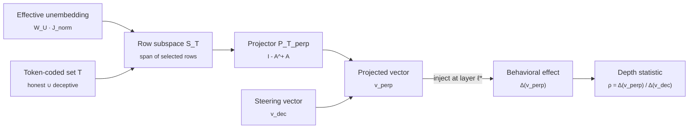

# liar-liar

> **Liar, Liar: Beyond Vocabulary Suppression.** A causal test of whether honesty steering manipulates an upstream representation or merely tilts the readout against deception-coded tokens, via token-conditional unembedding orthogonalization.
>
> [Read the proof (PDF)](docs/proof.pdf) · [Read the plan](PLAN.md) · [Source on GitHub](https://github.com/aryan-cs/liar-liar)

This repository hosts the formal apparatus and the experimental program for a project on whether representation-engineering steering vectors for deception actually manipulate an upstream concept or merely tilt the readout against a small lexicon of behavior-coded tokens. The mathematical machinery is in `docs/proof.tex` (compiled to `docs/proof.pdf`); the experimental program is in `PLAN.md`.

---

## In simple terms

A class of safety techniques nudges language models toward more honest answers by adding a vector to the model's internal state mid-computation. The reported benchmark gains do not distinguish two mechanisms. The vector may be moving an upstream representation of honesty that the rest of the model reads and acts on, or it may be making words like *lie* and *deceive* less likely at the output. Both produce the same headline scores.

This project constructs the test that separates the two. We project the vector orthogonal to the readout direction for a chosen set of honesty-coded words, so its direct effect on those words is zero, then measure how much honest behavior survives. Whatever survives came from somewhere other than vocabulary suppression.

The proof develops the construction. The plan specifies the models, benchmarks, and experiments that quantify the surviving effect.

---

## What is the question, in one paragraph?

Representation-engineering (RepE) interventions add a contrastively constructed vector to a transformer's residual stream at a middle layer; the reported effect is a reduction in deceptive, sycophantic, or refusal-violating behavior. The published numbers do not separate two distinct mechanisms. Under the *shallow* account, the vector tilts the final logit head against tokens such as *lie*, *trick*, *false*, *deceive*, and the intervention works because deception-coded words become improbable, with no semantic concept involved. Under the *deep* account, the vector moves an upstream representation that downstream attention and feed-forward layers consume, producing behavior that survives vocabulary substitution, paraphrase, and translation. The two accounts predict identical TruthfulQA scores and divergent out-of-distribution generalization. The field has implicitly assumed the second, and the standard experimental setup does not adjudicate.

---

## What this repository contributes

We separate the two mechanisms by construction. For a chosen deception-coded token set $T$, take the orthogonal complement of the rows of the effective unembedding matrix indexed by $T$ and project the steering vector $v_{\text{dec}}$ onto it to obtain $v^{\perp}$. The projected vector has zero direct logit contribution at every token in $T$. Injecting $v^{\perp}$ at the original intervention layer, any change in behavior cannot run through direct readout at $T$ and must propagate through downstream attention and feed-forward layers. The ratio of $v^{\perp}$'s behavioral effect to $v_{\text{dec}}$'s is the depth statistic.

The proof at [`docs/proof.pdf`](docs/proof.pdf) develops:

1. Why the naive global formulation is impossible. When the vocabulary exceeds the residual dimension, the unembedding matrix has trivial kernel and no nonzero vector is orthogonal to every unembedding row. The construction must be token-conditional.
2. The RMSNorm-corrected effective unembedding $\widetilde{W}_U^\star$, the actual object the post-norm readout maps from. Prior work projects against raw $W_U$; this is subtly wrong.
3. The minimum-norm characterization of the projection. The construction is the unique closest perturbation of $v_{\text{dec}}$ that produces zero direct effect on $T$, in the style of LEACE adapted to the token-conditional setting.
4. The direct-versus-indirect path decomposition that makes the test statistic meaningful.
5. The positioning against the closest precedents: LEACE, the Arditi refusal-direction orthogonalization, the Park-Choe-Veitch causal-inner-product duality, the Venkatesh-Kurapath non-identifiability result, and the Nadaf function-vector decoding gap.

The companion [`PLAN.md`](PLAN.md) specifies the experimental program: which checkpoints, which steering constructions, which token sets, which benchmarks, which OOD probes, and what each empirical outcome would mean.

---

## On the novelty gap

The closest prior work is:

- **LEACE** (Belrose et al., NeurIPS 2023). Minimum-norm projection that erases linear concept information from a representation. Same projection machinery, different subspace target.
- **Arditi et al.** (NeurIPS 2024). Project a refusal direction out of every matrix that writes to the residual stream. Same orthogonalization idiom, dual subspace.
- **Venkatesh and Kurapath** (arXiv:2602.06801, Feb 2026). Steering vectors are non-identifiable: orthogonal perturbations within the activation-to-logit Jacobian null space leave behavior unchanged. Closest theoretical precedent.
- **Nadaf** (arXiv:2604.02608, April 2026). Function vectors steer model behavior in cases where the logit lens cannot decode the steered output, demonstrating the off-readout channel exists for the function-vector setting.
- **hughvd's unembedding-steering-benchmark** (GitHub, 2024). Implements the unembedding-orthogonal steering construction on Gemma-2-9B with sentiment as the worked example.

The contribution is the application of this projection to deception steering on the modern deception benchmarks (MASK, Liars' Bench, DeceptionBench), the RMSNorm correction, and a quantitative summary via $\rho$ and $\sigma_T$.

---

## Construction at a glance



If $v_{\text{dec}}$ acts primarily through direct logit attribution at $T$, the projected vector $v^{\perp}$ has near-zero behavioral effect and $\rho \approx 0$. If $v_{\text{dec}}$ acts primarily through indirect propagation, $v^{\perp}$ preserves the effect and $\rho \approx 1$. The expected outcome is intermediate; the empirical questions are the value of $\rho$, its stability across $T$ choices, and its relationship to out-of-distribution generalization.

---

## Repository layout

```
liar-liar/
├── README.md                  ← you are here
├── PLAN.md                    ← experimental program
└── docs/
    ├── proof.tex              ← formal apparatus (LaTeX source)
    ├── proof.pdf              ← compiled proof
    └── PLAN_steering_rebels_legacy.md   ← prior plan for a separate project, preserved
```

When code lands, the expected structure is:

```
liar-liar/
├── liar/                      ← Python package
│   ├── unembedding/           ← W_U row extraction, RMSNorm Jacobian, P_T construction
│   ├── steering/              ← CAA, LAT, ITI, mass-mean implementations
│   ├── tokenset/              ← curated, statistical, probe-derived T constructions
│   ├── eval/                  ← MASK, Liars' Bench, DeceptionBench, TruthfulQA harnesses
│   └── ood/                   ← paraphrase, translation, vocab-substitution probes
├── experiments/               ← per-model run scripts and configs
├── results/                   ← persisted per-run JSON and per-model summary parquets
└── tests/
```

---

## How to read the documents

1. **[README.md](README.md)** *(this file)*. Orientation.
2. **[PLAN.md](PLAN.md)**. The experimental program: models, steering constructions, token-set designs, evaluation suite, OOD probes, and baselines.
3. **[docs/proof.pdf](docs/proof.pdf)**. The formal apparatus: the impossibility of the global formulation, the token-conditional construction, the RMSNorm correction, the rank-one variant, the direct-versus-indirect path decomposition, the depth statistic, the minimum-norm characterization, the prior-work positioning, and the limitations.

The load-bearing sections of the proof are **§4** (Token-Conditional Orthogonalization), which defines the construction, and **§6** (Direct-Versus-Indirect Path Decomposition), which justifies the depth statistic. §3 shows why the construction must be token-conditional; §9 positions the work against the closest prior projections.

---

## Building the proof PDF

The proof is standard LaTeX and compiles cleanly with [Tectonic](https://tectonic-typesetting.github.io/), which downloads required packages on first use.

```bash
# install once
brew install tectonic           # macOS
# or follow instructions for your platform

# compile
cd docs
tectonic proof.tex
```

This produces `docs/proof.pdf`. The pre-compiled PDF is committed so casual readers do not need a LaTeX toolchain.

A traditional `pdflatex` or `latexmk` toolchain works equivalently:

```bash
cd docs && latexmk -pdf proof.tex
```

---

## Status

| Milestone | State |
|-----------|-------|
| Formal apparatus written | done |
| Token-conditional construction proved well-defined and minimum-norm | done |
| RMSNorm correction worked out | done |
| Prior-work comparison written and citations verified | done |
| Experimental program defined | done |
| Reference implementation of $P_T^\perp$ and the four steering constructions | pending |
| Calibration on Llama-2-7B against published RepE/CAA/ITI numbers | pending |
| Full headline boxplot on the eight target checkpoints | pending |
| MASK and Liars' Bench full evaluation | pending |
| OOD generalization block (paraphrase, translation, vocab substitution) | pending |
| Path patching and SAE attribution on the deep outliers | pending |
| Writeup and submission | pending |

---

## A note on framing

The construction is operational. $\rho$ measures the proportion of a steering vector's behavioral effect that survives token-conditional readout suppression: a claim about the geometry of the residual stream. Disagreement should target the formal commitments (Theorems 6.1 and 8.1 in `docs/proof.pdf`) or the experimental design (`PLAN.md` §4); empirical claims await the experiments.

---

## Citation

A formal preprint will follow the empirical results. For now, please cite the repository.

```
@misc{gupta2026liarliar,
  title  = {Liar, Liar: Beyond Vocabulary Suppression},
  author = {Aryan Gupta},
  email  = {aryan.cs.app@gmail.com},
  year   = {2026},
  note   = {\url{https://github.com/aryan-cs/liar-liar}}
}
```

---

## License

The writeup, formal proof, experimental plan, and all documents in this repository are licensed under [Creative Commons Attribution-NonCommercial-NoDerivatives 4.0 International (CC BY-NC-ND 4.0)](https://creativecommons.org/licenses/by-nc-nd/4.0/). You may read and share with attribution; commercial use, derivative works, translations, condensations, and inclusion in training data require explicit prior written permission from the author. See [LICENSE](LICENSE) for the binding terms.

When experimental code is released, it will carry a separate software license in its own directory; the documents in this repository remain under CC BY-NC-ND 4.0.

For permission requests outside the terms of the license, contact `aryan.cs.app@gmail.com`.
